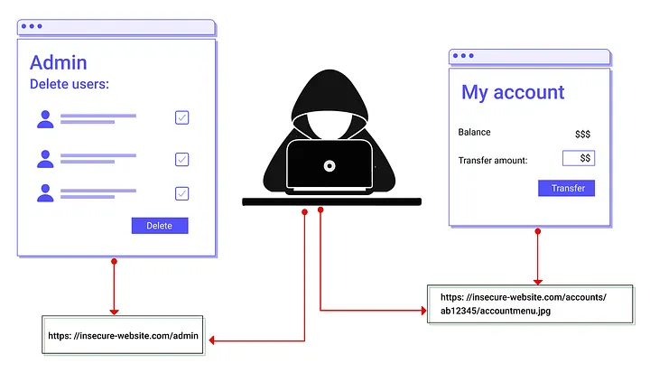
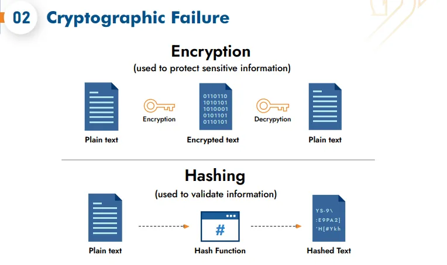
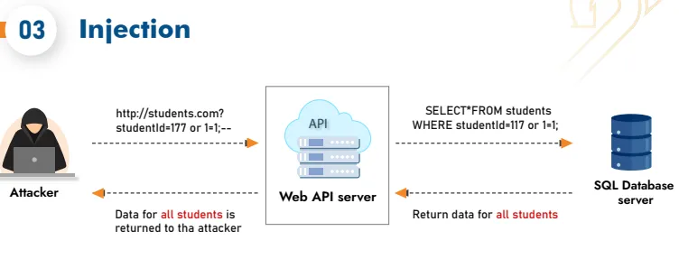
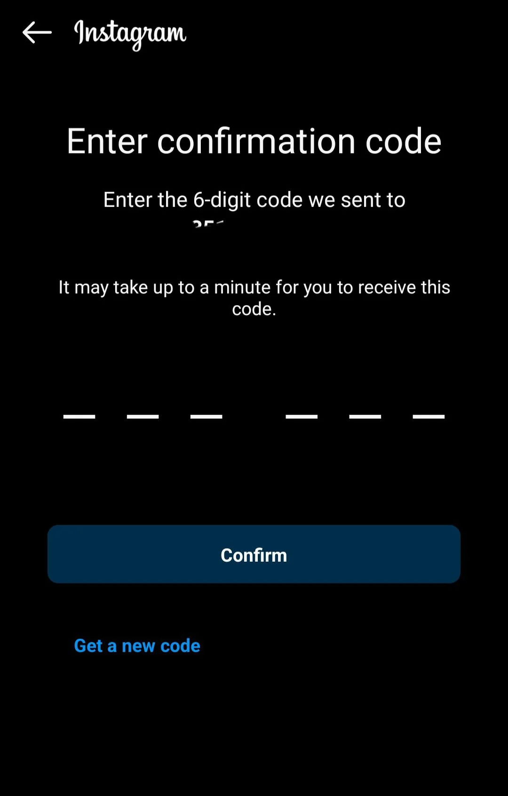

## Topic : OWASP Top 10-2021
----

This is a write-up for the room OWASPTop 10 on Tryhackme. In this journal I am going to sum-up the knowledges I learned from solving this room. So, enjoy going it this journal.

---
#### Introduction
This room has 10 topics which includes details on the vulnerabilities, how they occer, and how you can exploit them. The topics are:

1. Broken Access Control
2. Cryptographic Failures
3. Injection
4. Insecure Design
5. Security Misconfiguration
6. Vulnerable and Outdated Components
7. Identification and Authentication Failures
8. Software and Data Integrity Failures
9. Security Logging & Monitoring Failures
10. Server-Side Request Forgery (SSRF)

---
### 1. Broken Access Control

Broken access control means that users can access parts of a website they shouldn't, like viewing private videos or using admin features. 

This can happen if the website doesn't check who is allowed to do what. 

For example, in 2019, a flaw let anyone watch a single frame of a private YouTube video.

#### Broken Access Control (IDOR Challenge)
IDOR means you can access things you shouldn't by using a direct link, like seeing your bank account details by changing the URL.

So, a potentially huge problem here is that anyone may be able to change the id parameter to access to someone else's bank information. 

---
### 2. Cryptographic Failures
Cryptographic failures happen when sensitive information isn't protected well enough, letting attackers see it. This can happen in emails, bank accounts, or any data stored online. It can be simple mistakes like not using encryption or more complex attacks like intercepting data.

---
### 3. Injection

Injection flaws happen when user input is treated as commands or parameters, leading to attacks like SQL Injection or Command Injection. To prevent these, use techniques like parameterized queries, input validation, and restricting database access.

---
### 4. Insecure Design 

Insecure design is when the basic idea of an app is flawed from the start, often due to poor planning or shortcuts taken by developers. This can lead to vulnerabilities that are hard to fix later. For example, Instagram had a problem with password resets that could be exploited by attackers trying to guess the 6-digit code sent to users' phones. 

The issue was that Instagram only limited attempts from the same IP, making it easier for attackers to try many codes from different IPs. This shows that the design of the app, not just how it's implemented, can lead to security problems. To avoid these issues, it's important to plan and design with security in mind from the start, using secure development practices and threat modeling.

---
### 5. Security Misconfiguration

Security misconfigurations happen when security settings are not set up correctly, even if the software is up to date. This can include poorly set permissions, unnecessary features left on, default passwords not changed, and not using security headers. These mistakes can lead to vulnerabilities like default credentials, XML External Entities (XXE), or command injection. Debugging interfaces left on can also be a security risk, as seen with Patreon in 2015, where an open debug interface allowed attackers to execute commands.

---
### 6. Vulnerable and Outdated Components

Using outdated software like WordPress or Nostromo can make a company vulnerable to attacks. For example, if a company hasn't updated WordPress to a newer version, it might be vulnerable to a known exploit. This means attackers can use pre-made exploits to gain unauthorized access or execute code on the server. The key is to find out what software and version the company is using, then search for known vulnerabilities and exploits. Sometimes, exploit scripts need to be modified to work, but with known vulnerabilities, there's often a ready-made solution.

---
### 7. Identification and Authentication Failures

Authentication and session management are crucial for web apps to secure user data. Authentication verifies users' identities, often with a username and password, and session cookies track users' actions. If these systems are flawed, attackers can gain unauthorized access. Common flaws include weak passwords, predictable session cookies, and brute force attacks. To prevent these, use strong passwords, implement multi-factor authentication, and ensure secure session management.

---
### 8. Software and Data Integrity Failures

Integrity in cybersecurity means ensuring data remains unchanged and unmodified. This is crucial for protecting important information from unwanted changes. For example, when downloading a file, you can use a hash to check if the file was modified during download. Software and Data Integrity Failures occur when software or data is used without checking if it's been altered. This can happen if an app relies on untrusted sources or doesn't verify updates properly. To prevent these failures, it's important to use secure practices like integrity checks and secure update processes.

---
### 9. Security Logging and Monitoring Failures

Logging in web applications is crucial for tracking user actions and identifying potential attacks. It helps in understanding the attacker's activities, assessing the risk, and determining the impact. Without logging, it's difficult to trace what an attacker did if they gain access. Logs should include HTTP status codes, timestamps, usernames, API endpoints, IP addresses, and should be stored securely. Monitoring for suspicious activities, like multiple failed login attempts or requests from unusual IPs, is key to detecting and mitigating attacks early. Tools like Azure Log Analytics can help investigate anomalies and detect malicious activities.

### 10. Server-Side Request Forgery (SSRF)

Server-Side Request Forgery (SSRF) is when an attacker tricks a web app into sending requests to other servers on their behalf. This can happen when a web app uses external services, like sending SMS messages. If the app lets users choose the server to send requests to, an attacker could redirect these requests to their own server, steal sensitive information, or use the service at your expense. For example, changing the server parameter in a request to an attacker's server could let them capture the API key used for billing, allowing them to use the service for free. SSRF can be used for various malicious activities, including spying on internal networks, accessing restricted services, and even getting remote code execution.

---
In conclusion, the OWASP Top 10 for 2021 highlights the top security risks for web applications, emphasizing the need for strong security measures. It covers a wide range of issues, from access control problems to server-side request forgery. The key takeaway is that a comprehensive, multi-layered security approach is crucial to protect against these vulnerabilities. Regular updates, secure coding practices, and thorough testing are essential. By understanding and addressing these risks, we can better protect our applications and users from cyber threats.

