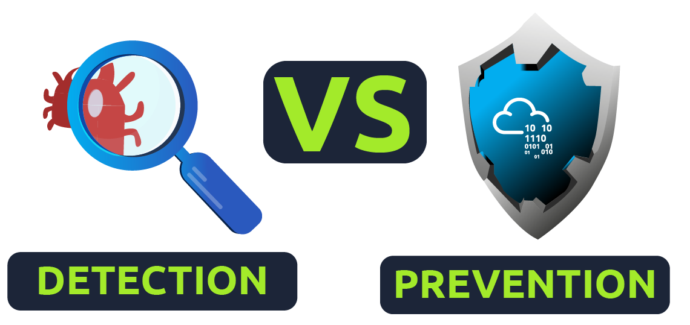

## Topic : Snort

----

### Objective:
In this journal I will write how Learn how to use Snort to detect real-time threats, analyse recorded traffic files and identify anomalies. And solve some of the questions.

### Introduction

Snort is one of the most popular NIDS/NIPS solutions avialable and is used by bussinesses, governments, and individuals around the world. The Tryhackme Snort room is a comprehensive training course that teaches you how to use Snort to protect your network from attack.

### Requirments expected:
* Familiar with basic Linux command-line functionalities. Like; general system navigation and Network fundamentals (port, protocols and traffic data).

### Interactive Material and VM

#### Interactive material and exercise setup

Need to deploy the machine, which will be visible in the split-screen view once it's ready. 

Once the machine has started, there is one folder 'TASK-Exercises' on the Desktop. Each exercise has an individual folder and files; use them accordingly to the questions.

#### Traffic Generator:

Run the "traffic generator.sh" file by executing it as sudo. 

Once you choose an action, the menu disappears and opens a terminal instance to show you the output of the action.

Navigate to the Task-Exercises folder and run the command "./.easy.sh" and write the output

### Introduction to IDS/IPS

#### Intrusion Detection System (IDS)

IDS is passive, detects threats, requires user intervention.

Types of IDS:
* NIDS: Monitors network traffic.
* HIDS: Monitors individual devices.

#### Intrusion Prevention System (IPS)

IPS is active, blocks threats automatically.

Types of IPS:
* NIPS: Protects network traffic.
* Behavior-based (NBA): Requires learning normal traffic.
* WIPS: Protects wireless traffic.
* HIPS: Protects individual devices

#### Detection/Prevention Techniques

* Signature-Based: Detects known threats.
* Behavior-Based: Identifies new threats.
* Policy-Based: Checks against system configurations.

#### Answer the questions below

Which snort mode can help you stop the threats on a local machine?

Answer: HIPS

Which snort mode can help you detect threats on a local network?

Answer: NIDS

Which snort mode can help you detect the threats on a local machine?

Answer: HIDS

Which snort mode can help you stop the threats on a local network?

Answer: NIPS

Which snort mode works similar to NIPS mode?

Answer: NBA

According to the official description of the snort, what kind of NIPS is it?

Answer: full-blown

NBA training period is also known as …

Answer: baselining

### First Interation with Snort

Verify snort is installed. By "user@ubuntu$ snort -V".

Ensure our configuration file is valid.

 "-T" is used for testing configuration, and "-c" is identifying the configuration file (snort.conf).

Once the configuration file is used, the snort gets much more power! The configuration file is an all-in-one management file of the snort.

### Operation Mode 1: Sniffer Mode

#### Snort Sniffer Modes
Snort, a popular intrusion detection system, offers various modes to capture and analyze network traffic. These modes allow users to view different aspects of the captured packets, enhancing the ability to identify and filter malicious IP addresses.

#### Key Parameters
* -v (Verbose): Displays TCP/IP output in the console.
* -d (Dump): Shows packet data (payload).
* -e (Link-Layer Headers): Displays link-layer headers.
* -X (Full Packet Details in HEX): Provides full packet details in hexadecimal format.
* -i (Interface): Specifies a particular network interface to listen/sniff on.

### Operation Mode 2: Packet Logger Mode

Snort is a powerful tool for network traffic analysis and intrusion detection. One of its key features is its ability to operate in logger mode, allowing it to record network traffic for later analysis. This mode is particularly useful for forensic investigations, network troubleshooting, and understanding network behavior.

#### Logger Mode Parameters
* -l: Sets the directory for log and alert outputs. By default, Snort logs to /var/log/snort.
* -K ASCII: Logs packets in ASCII format, making them easier to read and analyze manually.
* -r: Reads previously logged packets from a file.
* -n: Limits the number of packets processed or read, stopping after reaching the specified count.

#### Logging with -l
* To start logging, use sudo snort -dev -l.. This command initiates Snort in logger mode, directing logs to the current directory.
* After running a traffic generator script to produce network activity, Snort begins recording packets in the specified directory.

#### Logging with -K ASCII
* Switching to -K ASCII changes the log format to ASCII, creating readable files organized by IP address.
* Example command: sudo snort -dev -K ASCII -l.
* This mode facilitates manual inspection of logs without needing specialized tools.

#### Reading Logs with -r
* Use -r to read previously recorded logs, allowing Snort to replay and analyze the stored packets.
* Command: sudo snort -r snort.log.1638459842
* This mode is useful for analyzing historical data or reproducing network conditions for testing.

### Operation Mode 3: IDS/IPS

#### Snort IDS/IPS Modes
Snort operates in various modes, including Network Intrusion Detection System (NIDS), Network Intrusion Prevention System (NIPS), and logger mode. Each mode serves different purposes:

* NIDS: Monitors network traffic for malicious activities.
* NIPS: Prevents attacks by blocking malicious traffic.
* Logger: Records network traffic for analysis.

#### Operating Logic and Configuration Testing
To utilize Snort effectively, understanding its operating logic and how to configure it properly is crucial. The -c parameter specifies the configuration file, and -T tests the configuration for errors. Other parameters control the operation mode (-A) and whether logging is enabled (-N), among others.

#### Key Parameters
* -c: Specifies the configuration file path.
* -T: Tests the configuration file for errors.
* -N: Disables logging.
* -D: Runs Snort in background mode.
* -A: Controls the alert mode:
    * full: Provides detailed alerts.
    * fast: Shows brief alerts.
    * console: Displays alerts on the console.
    * cmg: Outputs basic header details with payload.
    * none: Disables alerts.

#### Running Snort in IDS/IPS Mode
IDS/IPS Mode with -c and -T
* Test the configuration file: sudo snort -c /etc/snort/snort.conf -T
* This checks for configuration errors.

IDS/IPS Mode with -N
* Disable logging: sudo snort -c /etc/snort/snort.conf -N
* Still processes traffic but does not log it.

IDS/IPS Mode with -D
* Run Snort in background mode: sudo snort -c /etc/snort/snort.conf -D
* Useful for automating Snort in scripts.

IDS/IPS Mode with -A
* Alert modes vary based on the parameter:
    * console, cmg, full, fast, none affect the detail and location of alerts.

IDS/IPS Mode with -A console
* Alerts displayed on the console: sudo snort -c /etc/snort/snort.conf -A console

IDS/IPS Mode with -A cmg
* Basic header details with payload: sudo snort -c /etc/snort/snort.conf -A cmg

IDS/IPS Mode with -A fast
* Brief alerts: sudo snort -c /etc/snort/snort.conf -A fast

IDS/IPS Mode with -A full
* Detailed alerts: sudo snort -c /etc/snort/snort.conf -A full

IDS/IPS Mode with -A none
* No alerts, just logs: sudo snort -c /etc/snort/snort.conf -A none

Using Rule File Without Configuration File
* Test user-created rules: sudo snort -c /etc/snort/rules/local.rules -A console

IPS Mode and Dropping Packets
* Activate IPS mode with -Q --daq afpacket: sudo snort -c /etc/snort/snort.conf -q -Q --daq afpacket -i eth0:eth1 -A console
* Requires at least two interfaces.

### Operation Mode 4: PCAP Investigation

Purpose: To understand how Snort processes PCAP files for network traffic analysis and threat detection.

Key Features: Snort's ability to analyze PCAP files, generate alerts based on rulesets, and differentiate between multiple PCAP files.

#### Parameters:
* -r / --pcap-single=: Reads a single PCAP file.
* --pcap-list="": Processes multiple PCAP files listed in the command.
* --pcap-show: Displays the name of the PCAP file being processed.

#### Investigating a Single PCAP File
* Command: sudo snort -c /etc/snort/snort.conf -q -r icmp-test.pcap -A console -n 10
* Output: Generated alerts based on the Snort ruleset applied to icmp-test.pcap.

#### Investigating Multiple PCAP Files
* Command: sudo snort -c /etc/snort/snort.conf -q --pcap-list="icmp-test.pcap http2.pcap" -A console
* Output: Alerts from both icmp-test.pcap and http2.pcap, showcasing Snort's handling of multiple files.

#### Distinguishing Between Multiple PCAP Files
* Command: sudo snort -c /etc/snort/snort.conf -q --pcap-list="icmp-test.pcap http2.pcap" -A console --pcap-show
* Output: Alerts labeled with the name of the PCAP file they originated from, aiding in differentiation.

### Snort Rule Structure

#### Introduction to Snort Rules
* Essential for Blue and Purple Teamers: Understanding Snort rule format is crucial for network security operations.
* Default Mode: Snort operates in passive mode (IDS) by default, switch to inline mode (IPS) for active blocking.
* Rule Complexity: Easy to understand but challenging to create efficiently. Practice and study rule options are key to mastery.

#### Basic Rule Components
* Action: Defines the rule's outcome (alert, log, drop, reject).
* Protocol: Specifies the protocol (IP, TCP, UDP, ICMP).
* IP and Port Numbers: Identifies source and destination IPs and ports.
* Direction: Indicates traffic flow (-> for source to destination, <> for bidirectional).

#### Actions
* alert: Generates an alert and logs the packet.
* log: Logs the packet without generating an alert.
* drop: Blocks and logs the packet.
* reject: Blocks the packet, logs it, and terminates the session.

#### IP and Port Filtering
* Single IP: alert icmp 192.168.1.56 any <> any any
* IP Range: alert icmp 192.168.1.0/24 any <> any any
* Multiple IP Ranges: alert icmp [192.168.1.0/24, 10.1.1.0/24] any <> any any
* Exclude IP Addresses/Ranges: alert icmp192.168.1.0/24 any <> any any
* Port Filtering: alert tcp any any <> any 21
* Exclude Specific Ports: alert tcp any any <> any21
* Port Range Filtering: alert tcp any any <> any 1:1024, alert tcp any any <> any :1024, alert tcp any any <> any 1025:, alert tcp any any <> any [21,23]

#### Direction Operators
* Source to Destination: ->
* Bidirectional: <>

#### General Rule Options
* msg: Provides a brief description of the rule.
* sid: Unique ID for the rule.
* reference: External references like CVE IDs.
* rev: Revision number for the rule.

#### Payload Detection Rule Options
* content: Matches specific payload data.
* nocase: Disables case sensitivity.
* fast_pattern: Prioritizes content search for faster evaluation.

#### Non-Payload Detection Rule Options
* id: Filters the IP ID field.
* flags: Filters TCP flags.
* dsize: Filters packet payload size.
* sameip: Filters for duplicate source and destination IP addresses.

#### Modifying Local Rules
* Edit /etc/snort/rules/local.rules for custom rules.

### Snort2 Operation Logic: Points to Remember

#### Main Components of Snort
* Packet Decoder: Collects and prepares packets for pre-processing.
* Pre-processors: Arranges and modifies packets for the detection engine.
* Detection Engine: Analyzes packets by applying rules.
* Logging and Alerting: Handles log and alert generation.
* Outputs and Plugins: Integrates outputs (e.g., syslog/mysql) and supports plugins for rule management and detection.

#### Types of Snort Rules
* Community Rules: Free, publicly accessible, GPLv2 licensed.
* Registered Rules: Free, requires registration, with a 30-day delay.
* Subscriber Rules: Paid, requires subscription, updated twice weekly.

#### Configuration Files
* snort.conf: Main configuration file.
* local.rules: User-generated rules file.

#### Editing snort.conf
* Navigate to "Set the network variables."
    * HOME_NET: Protected network area.
    * EXTERNAL_NET: External network, typically set to 'any' or '!$HOME_NET'.
    * RULE_PATH, SO_RULE_PATH, PREPROC_RULE_PATH: Paths for hardcoded and dynamic rules.

#### Configuring the Decoder
* Manage IPS mode with "afpacket" for single-node installations.
    * DAQ: Data Acquisition Module, selects packet I/O method.
        * Pcap: Default mode (Sniffer).
        * Afpacket: Inline mode (IPS).
        * Other modes include Ipq, Nfq, Ipfw, Dump.

#### Configuring Output Plugins
* Manage IDS/IPS action outputs, such as logging and alert formats.

#### Customizing Your Ruleset
* Include user-specific and downloaded rules.
    * site specific rules: Activate with include $RULE_PATH/local.rules.
    * default/downloaded rules: Activate with include $RULE_PATH/rulename

