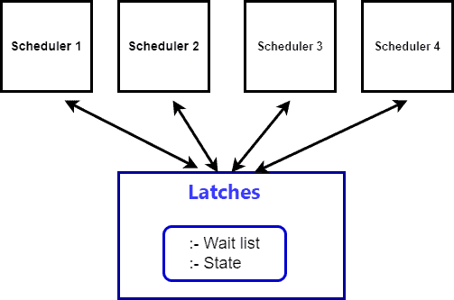
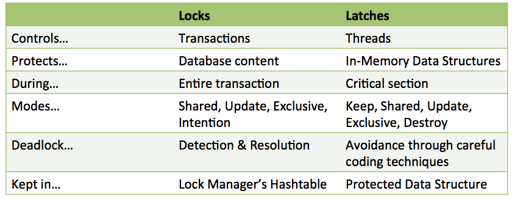

### Topic : Lock And Laches

---

### Introduction

Hello everyone! So, in our flippedClass 11, we learned about the lock and laches which are the mechanisms used to control access to data to ensure consistency and integrity. We even learned about the concurrency control in dtaabse systems.

### What is Lock?
Locking is a technique used to manage access to database objects (such as tables, rows, or pages) by multiple transactions. It prevents concurrent transactions from interfering with each other, thus maintaining data consistency.

#### Types of Locks:
* Shared Lock(S): Allows multiple to read a resource but not modify it. 
* Exclusive Lock(X): Allows only one transaction to both read and modify a resourse.
* Update Lock(U): Used to prevent deadlocks in situatios where a transaction intends to update a resource. 

### What is Latches? 
A latch is a synchronization mechanism used for concurrent access control and to ensure data consistency.

The design of a latch enables rapid acquisition and release, typically occurring within a single CPU cycle, which makes it highly suitable for protecting frequently accessed data structures within a DBMS:

### Difference betwwen Lock and Latches:

### Concurrency Control in Database Systems
Concurrency control is essential for ensuring data integrity and consistency in a multi-user environment. By employing techniques such as lock-based protocols, timestamp-based protocols, optimistic concurrency control, and MVCC, database systems can manage concurrent transactions effectively. Understanding and properly configuring these mechanisms based on specific application needs can significantly enhance database performance and reliability.