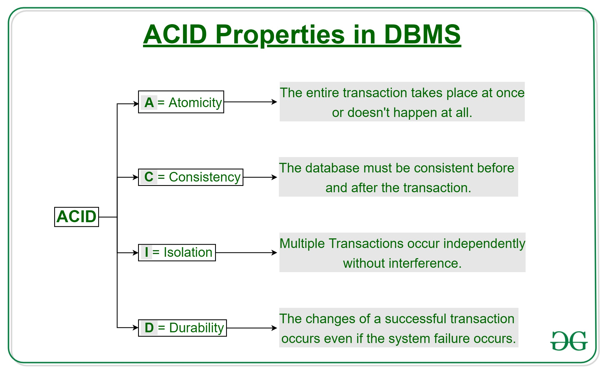

### Introduction

In our flipped class we learned about transactions in database which I will be sharing the knowledge I acquired from the flipped class. So, do go through my journal.

### What is a Transaction?

A transaction is a collection of operations that together form a single logical unit of work. This unit of work can access and potentially update various data items.
It ensures that either all the operations are completed successfully, or not at all.

A transaction is delimited by statements (or function calls)
of the form begin transaction and end transaction.
The transaction consists of all operations executed between
the begin transaction and end transaction.

For example, if you are performing a bank transfer:

1. 'begin tansaction'
2. Deduct amount from Acount A
3. Add amount to Account B
4. 'end transaction'

If any operation fails within this sequence, the entire transaction fails, ensuring data integrity and consistency.

#### Properties of Transaction:

Transaction follows this ACID properties.

#### A simple Transaction Model

Let's do this transaction in PostgreSQL for better understanding the trensaction.

- I'm creating a database named 'test_transaction' and let's use this database.
  

- I have created a table 'account' and I have inserted the values inside the table.
  

- Here, I have first retrieved the data using 'SELECT \* FROM accounts;' to show the current inserted values.
- Then, 'BEGIN;' command is used to begin the transaction.
- The first update command decreases the balance from the account A by 500. Then, the secound update command increases the balance of the account B by 500.
- Then, I used 'COMMIT' command to finalize the transcaion.
- After the transaction has been committed I have shown the result by 'SELECT \* FROM accounts;' command.
  

### Serializability

To understand serializability, I will break down the concept.

#### What is a Schedule?

In a database, a schedule is the order in which a series of transaction are executed.

#### Serial Schedule and Non-Serial Schedule

- Serial Schedule: Transactions are executed one after the other, without overlapping. This means one transaction is fully completed before the next one starts.
  - Example: Transaction A runs completely, then Transaction B runs completely.
- Non-Serial Schedule: Transactions are interleaved, meaning operations from different transactions are mixed together.
  - Example: Some operations of Transaction A are followed by some operations of Transaction B, and then back to Transaction A, and so on.

#### What is Serializability?

Serializability is a concept that helps ensure that even if transactions are interleaved (in a non-serial schedule), the end result will be the same as if the transactions were executed one after the other (in a serial schedule).

#### Testing of Serializability

To test the serializability of a schedule, we can use Serialization Graph or Precedence Graph. A serialization Graph is nothing but a Directed Graph of the entire transactions of a schedule.

#### Types of Serializability

Serializability of any non-serial schedule can be verified using two types mainly: Conflict Serializability and View Serializability.

- Conflict Serializability: Focuses on the order of conflicting operations. Uses a precedence graph to detect cycles. If no cycles, the schedule is conflict serializable.
- View Serializability: Ensures that the final state of the database is the same as a serial schedule. Considers the read and write operations, even if they don’t conflict directly.

Thank you